<div align="center">

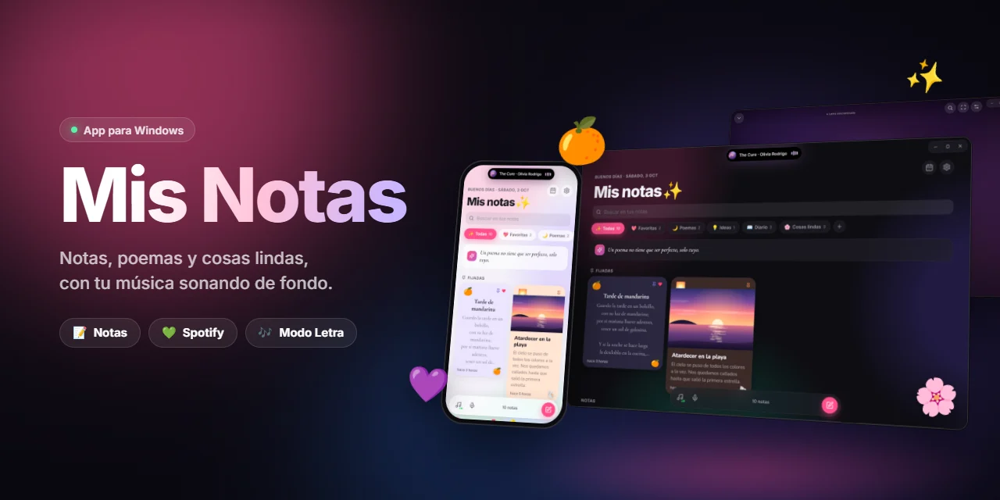

<br>

<a href="https://github.com/Tkyoxx/mis-notas/releases/latest"></a>


<br><br>

App de notas para Windows con estilo de iPhone. Sirve para escribir notas, poemas y cosas lindas,<br>controlar Spotify y ver la letra de la canción que suena.

<br>

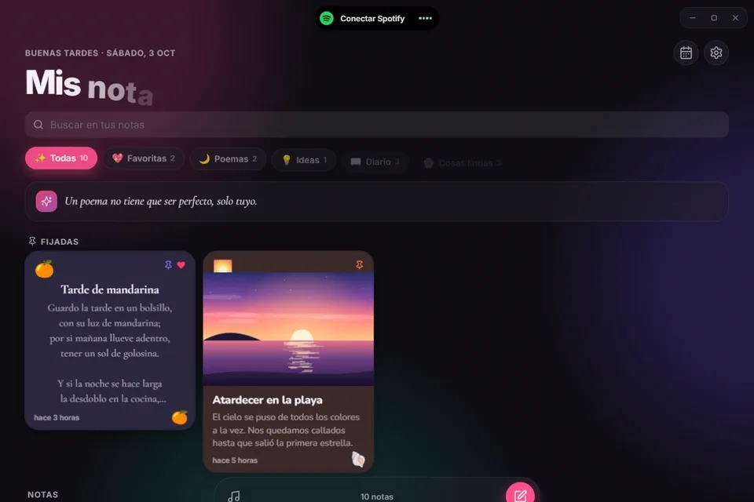

</div>


## Funciones

- Notas con distintos papeles, letras, stickers y carpetas.
- Fotos y dibujos a mano dentro de las notas.
- Notas privadas cifradas con PIN.
- Diario con calendario y racha de días.
- Compartir una nota o una frase de canción como imagen.
- Control de Spotify desde la isla de arriba.
- Modo Letra con letras sincronizadas, fondos animados y video musical.
- Uso desde el celular en la misma red Wi-Fi, emparejado con un código QR.

<br>

<picture>
  <source media="(prefers-color-scheme: light)" srcset="docs/img/home-light.webp">
  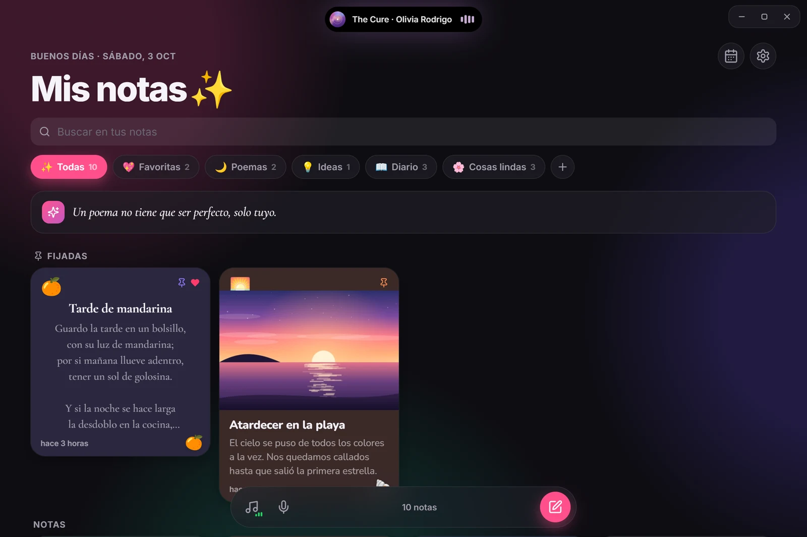
</picture>

<p align="center"><sub>Se adapta al tema claro u oscuro de Windows (y esta imagen también cambia con el tema de GitHub).</sub></p>

<table>
  <tr>
    <td width="50%" valign="top">
      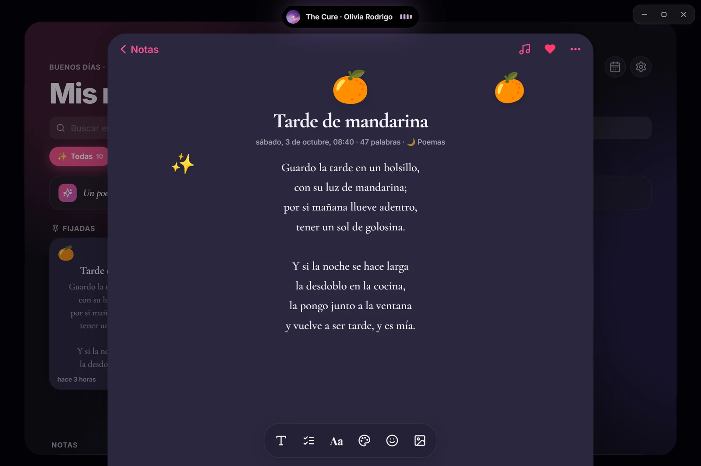
      <h3>Cada nota con su estilo</h3>
      Ocho papeles, siete letras, líneas, cuadros o puntos, y stickers que se arrastran a donde quieras.
    </td>
    <td width="50%" valign="top">
      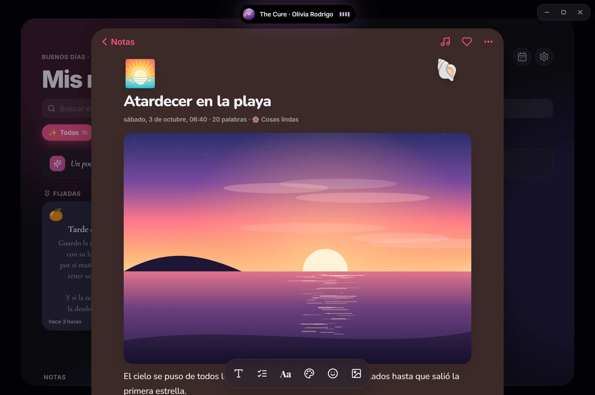
      <h3>Fotos</h3>
      Pega con <kbd>Ctrl</kbd>+<kbd>V</kbd>, arrastra una imagen o elígela desde la barra. Un clic la abre en grande.
    </td>
  </tr>
  <tr>
    <td width="50%" valign="top">
      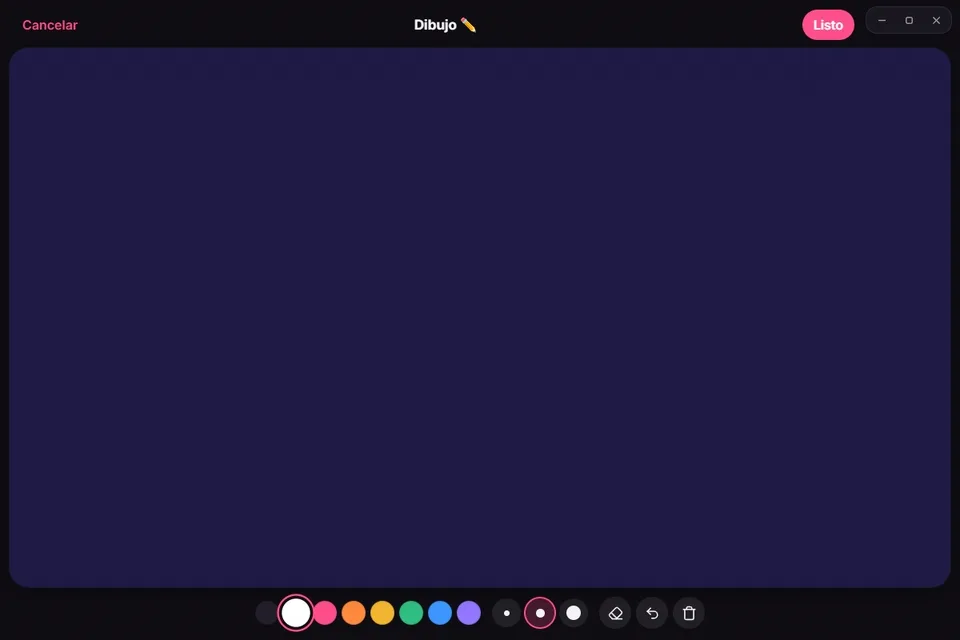
      <h3>Dibujo a mano</h3>
      Colores, tres grosores, borrador y deshacer. Con lápiz táctil respeta la presión.
    </td>
    <td width="50%" valign="top">
      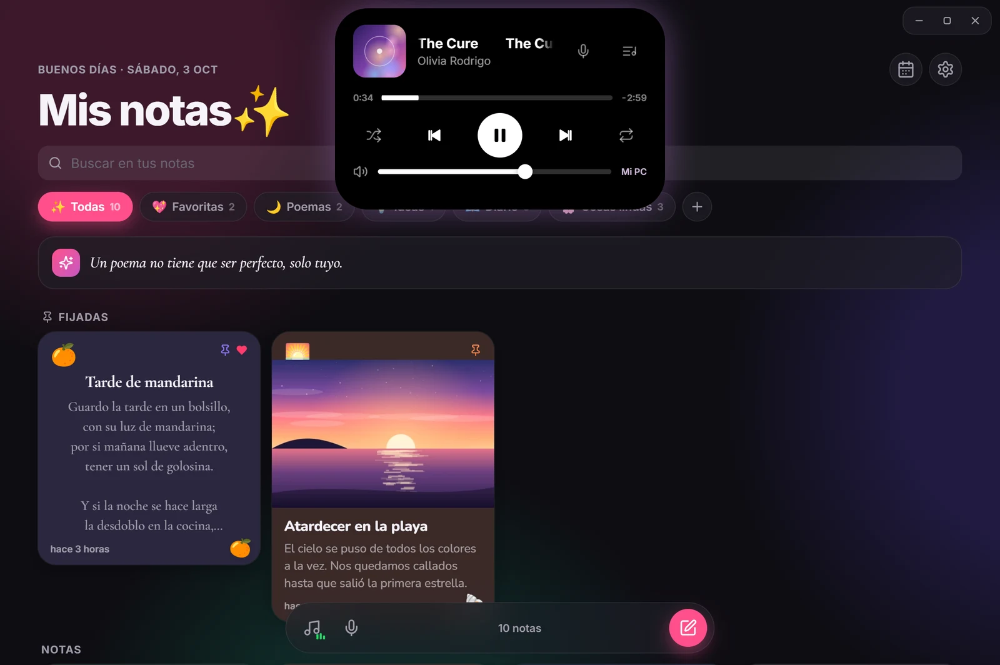
      <h3>Tu música arriba</h3>
      La isla muestra lo que suena en Spotify. Al tocarla se abre el reproductor con volumen y dispositivos.
    </td>
  </tr>
  <tr>
    <td width="50%" valign="top">
      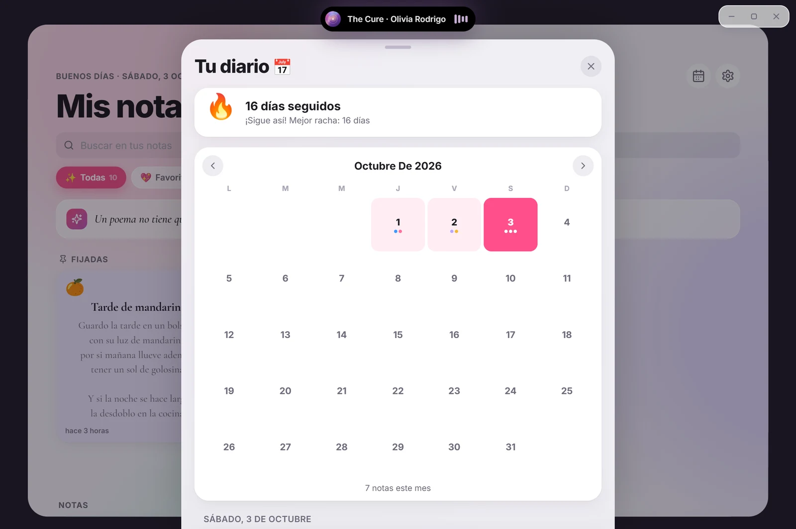
      <h3>Diario</h3>
      Calendario del mes, racha de días seguidos y lo que escribiste un día como hoy.
    </td>
    <td width="50%" valign="top">
      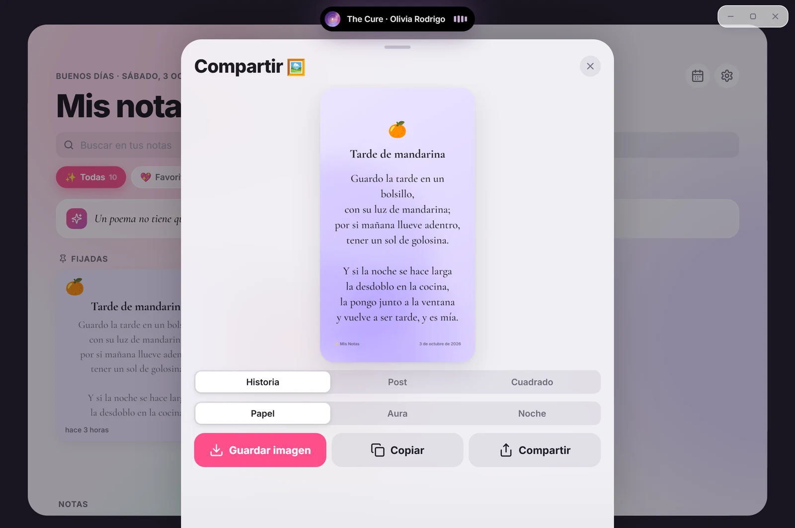
      <h3>Compartir como imagen</h3>
      Formatos Historia, Post y Cuadrado, con estilos Papel, Aura y Noche.
    </td>
  </tr>
</table>


## Modo Letra

<div align="center">
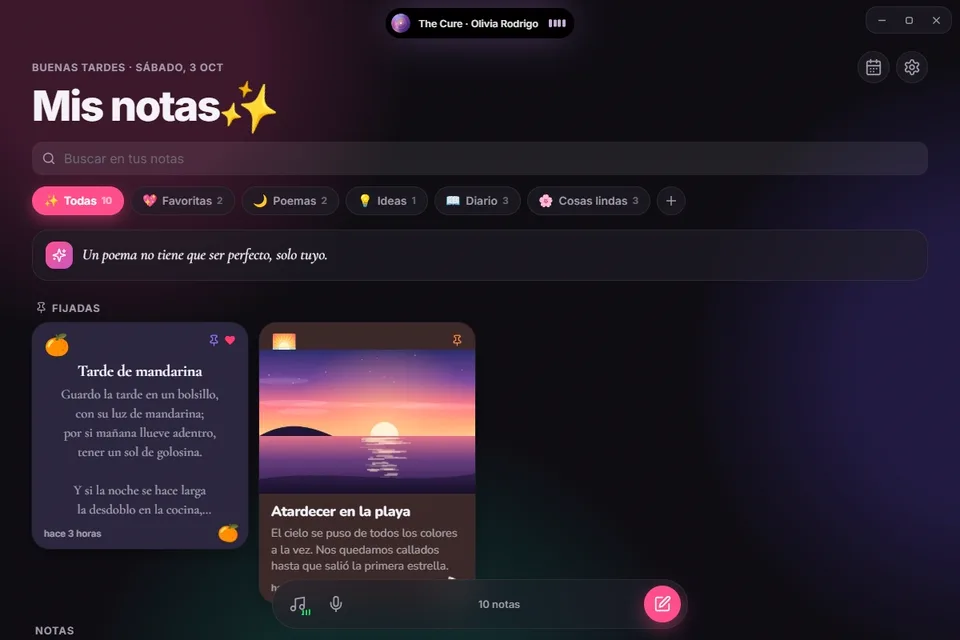
</div>

<br>

Tres estilos (Cascada, Enfoque y Una línea) y varios fondos que toman los colores de la portada: Aura, Noche estrellada, Lluvia, Pétalos, Nieve o el video musical de la canción.

<table>
  <tr>
    <td width="33%">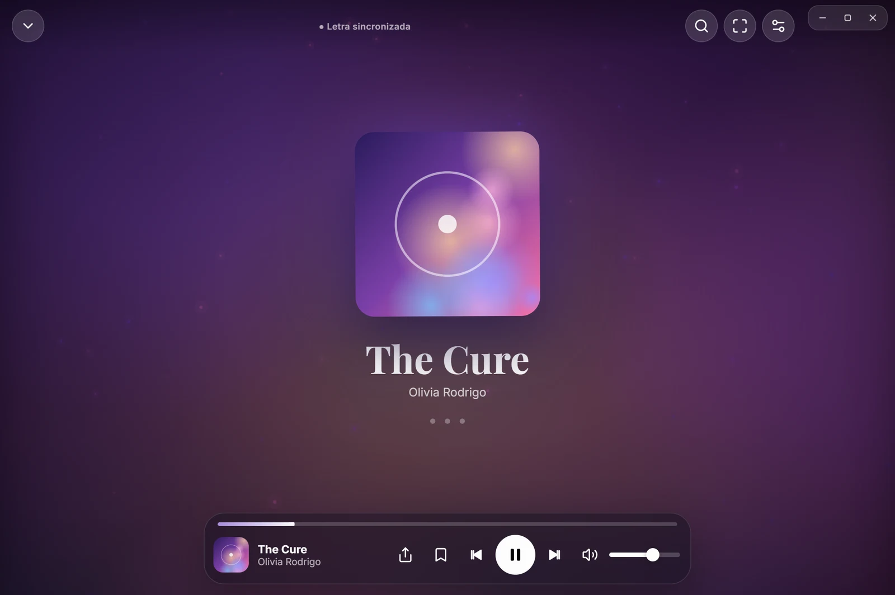<p align="center"><sub>Aura</sub></p></td>
    <td width="33%">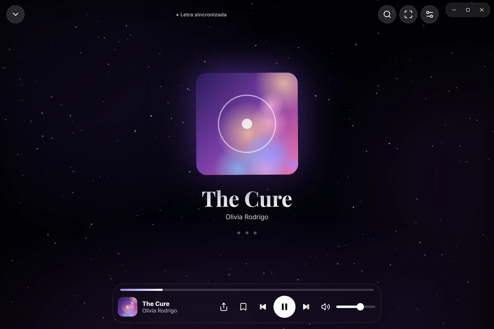<p align="center"><sub>Noche estrellada</sub></p></td>
    <td width="33%">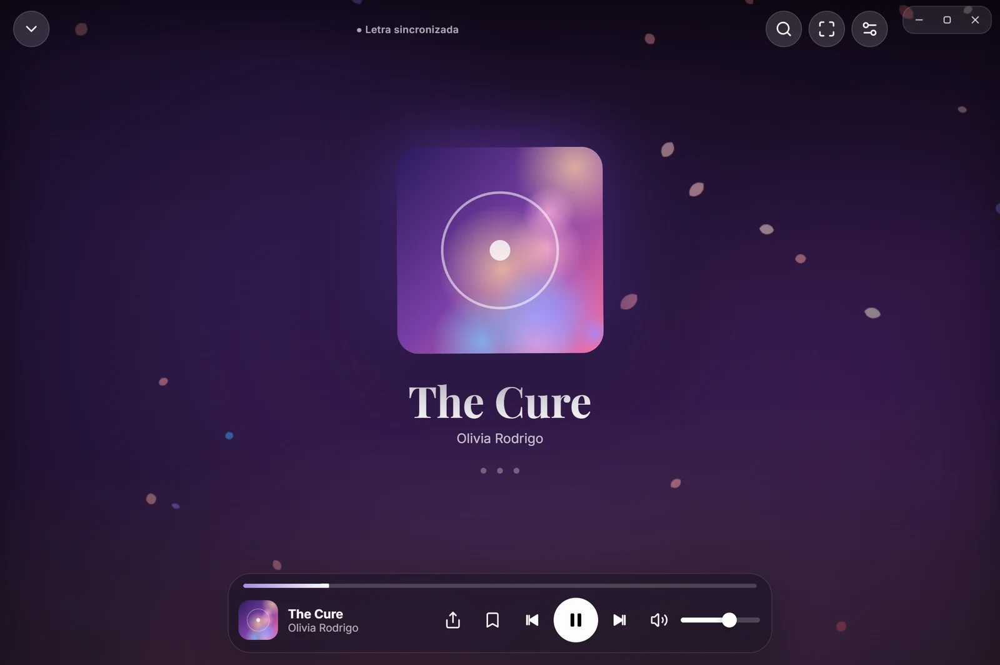<p align="center"><sub>Pétalos</sub></p></td>
  </tr>
</table>


## En el celular

<table>
  <tr>
    <td width="40%" valign="middle">
      Activa <b>Ajustes → Celular</b>, escanea el código QR y listo: las mismas notas y el mismo Spotify desde el celular, mientras estén en la misma red Wi-Fi.
      <br><br>
      En Chrome puedes tocar <b>⋮ → Agregar a la pantalla principal</b> para tenerla como app.
    </td>
    <td width="20%">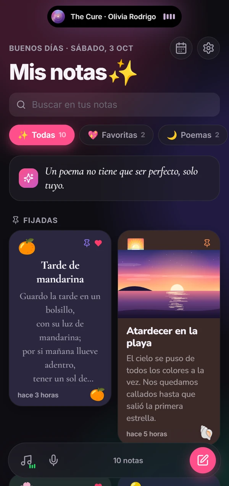</td>
    <td width="20%">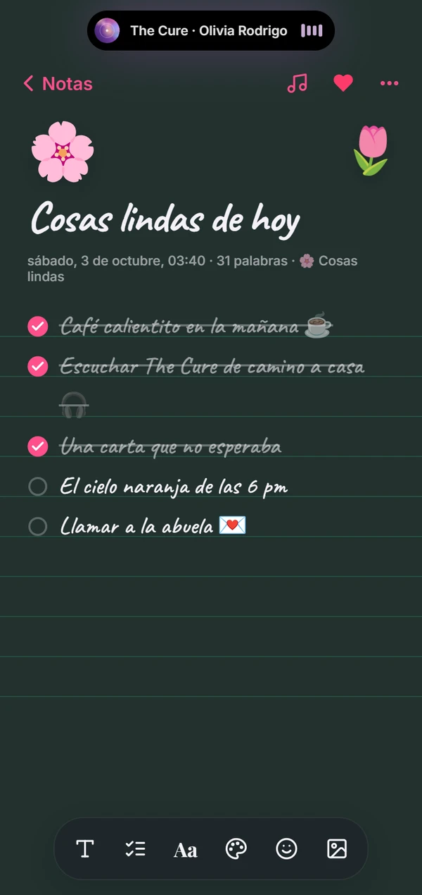</td>
    <td width="20%">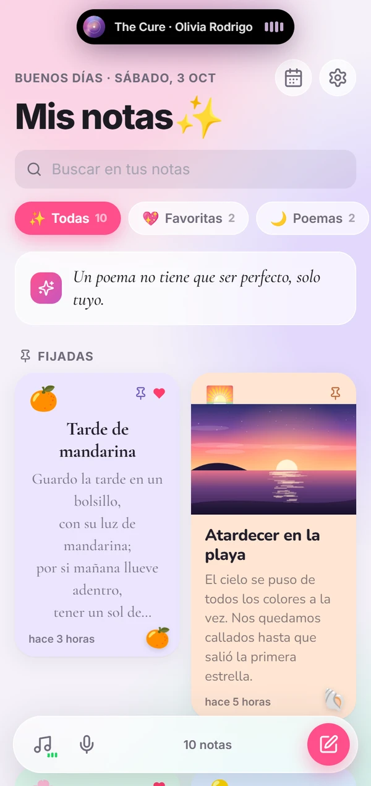</td>
  </tr>
</table>


## Instalar

Descarga el instalador desde la sección de *Releases* y ábrelo. Como el instalador no está firmado, Windows puede mostrar "Windows protegió su PC": toca **Más información** y luego **Ejecutar de todas formas**.

## Compilar desde el código

Necesitas [Node.js](https://nodejs.org) 20 o más nuevo.

```bash
npm install
```

```bash
npm start
```

| Comando | Qué hace |
| --- | --- |
| `npm start` | Abre la app de escritorio |
| `npm run web` | Abre la versión de navegador en http://127.0.0.1:5173 |
| `npm run build` | Crea el instalador en `dist/` |
| `npm run icon` | Regenera los íconos de `build/` |

## Conectar Spotify

1. Entra a https://developer.spotify.com/dashboard y crea una app.
2. Marca **Web API** y en **Redirect URI** pon `http://127.0.0.1:5173/`.
3. Copia el **Client ID** y pégalo en la app (toca la isla de arriba y luego **Conectar**).

Para cambiar canción y volumen hace falta Spotify Premium. Si Spotify dice "usuario no registrado", agrega tu correo en **User Management** dentro de tu app del dashboard.

## Dónde se guardan los datos

Todo queda en `%APPDATA%\Mis Notas`:

- `datos.json`: notas, carpetas y ajustes, con un respaldo diario en `respaldos\` (se guardan 14 días).
- `media\`: fotos y dibujos.
- `registro.txt`: errores de la app, útil si algo falla.

Desinstalar la app no borra tus notas.

## Privacidad

- La app corre un servidor local que solo escucha en `127.0.0.1`. Ninguna página web puede leer tus notas.
- La función para el celular está apagada de fábrica. Al activarla, solo entran los celulares emparejados con un código QR de un solo uso que vence en 5 minutos. Se pueden quitar desde Ajustes.
- Las notas privadas se cifran con AES-256-GCM usando tu PIN. Si olvidas el PIN no se pueden recuperar. Las fotos de una nota privada no se cifran.
- La app solo se conecta a Spotify, a [LRCLIB](https://lrclib.net) para las letras y a YouTube para los videos musicales.

## Si la ventana queda en blanco

Algunos drivers de video fallan con la aceleración gráfica. La app lo detecta y se reinicia sola en modo compatible. También puedes activarlo o quitarlo con **Ctrl+Shift+G**.

## Atajos

| Atajo | Acción |
| --- | --- |
| `L` | Modo Letra |
| `/` | Buscar música en el modo Letra |
| `Ctrl+Z` | Deshacer en el dibujo |
| `F11` | Pantalla completa |
| `Ctrl` `+` / `-` / `0` | Zoom |
| `Ctrl+Shift+G` | Modo compatible |

## Créditos

Las fuentes (Inter, Nunito, Caveat, Dancing Script, Playfair Display, Cormorant Garamond, Courier Prime y Noto Color Emoji) son de Google Fonts, con licencia SIL Open Font License.

Las capturas usan notas de ejemplo.


